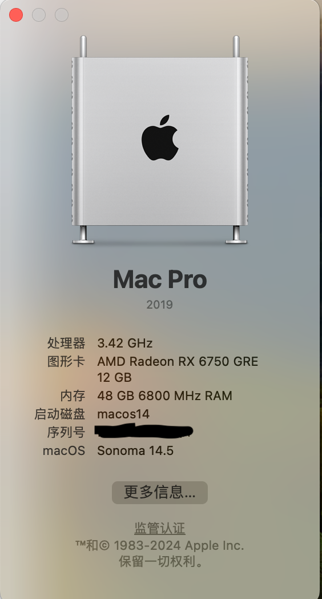

# MSI-B760M-MOTAR-WIFI-D5-14700KF-RX6760GRE-Hackintosh

**macOS**

* sonoma 14.5

---
**hardware info**

| 名称       | 品牌型号           | 
| ------------- |:-------------:| 
| CPU      | intel i7-14700KF         |
| 主板      | MSI B760M MOTAR WIFI Ⅱ    |
| 内存      | g.skill DRR5 6800MHz 24*2 |
| 显卡      | AMD 6750GRE 12G 技嘉      |
| 网卡      | intel AX211(主板自带)      | 

---
**screenshot**

